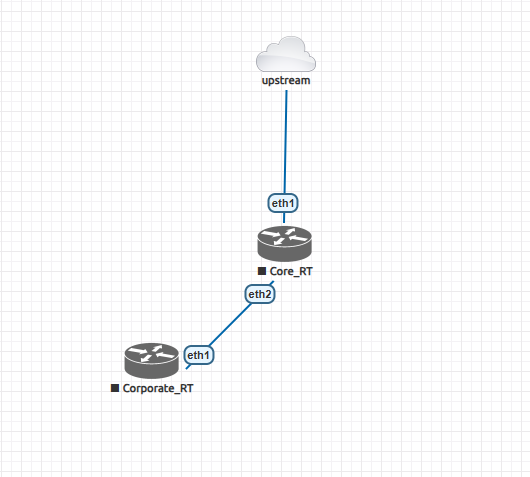
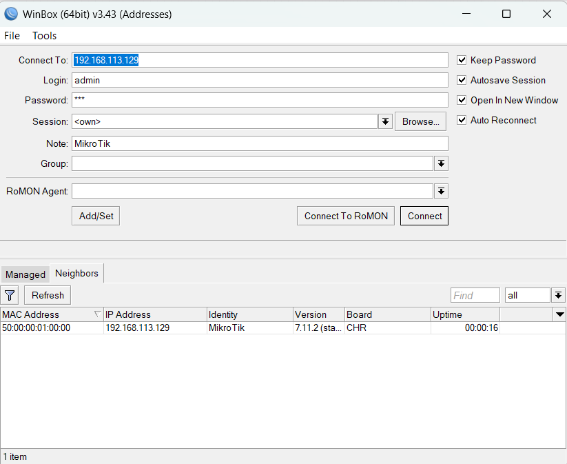
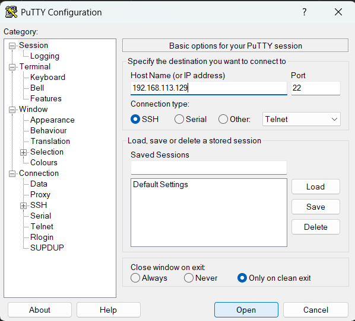

# EVE-NG Lab Setup (Basic Workflow)

## Overview
This project documents my basic workflow of setting up and working with an EVE-NG lab environment. It includes virtual machine setup, router image upload, topology design, and router access using different tools.

---

## Tools & Technologies
- VMware
- EVE-NG
- WinSCP
- Winbox
- PuTTY

---

## Step-by-Step Process

### 1. Virtual Machine Setup
- Created a virtual machine using VMware
- VM configuration file: `mkt_b_47.vmx`

### 2. Accessing EVE-NG
- Started the virtual machine
- Accessed the EVE-NG lab environment via web browser

### 3. Uploading Router OS
- Used WinSCP to upload router OS images into EVE-NG

### 4. Topology Design
- Designed and configured network topology inside EVE-NG

### 5. Router Access & Configuration
- Used Winbox to access routers (GUI)
- Used PuTTY for CLI-based access and configuration

---

## Purpose
The purpose of this lab is to learn and practice network simulation and router configuration using EVE-NG.

---

## Screenshots

### Topology

### Router Access via Winbox

### CLI Access via PuTTY

